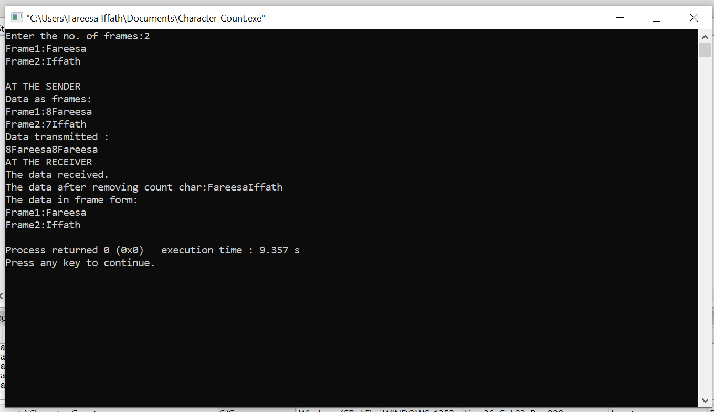

# AIM : To implement Character Count on the given data.

## PROCEDURE :

## Step-1 : Start.

## Step-2 : Read the number of frames given as input.

## Step-3: Now read the frames one by one.

## Step-4 : Append the number greater than the length of frame at the begninning of the frame.

## Step-5 : This data is transferred to the reciever.

## Step-6 : At the reciever end read the transmitted data.

## Step-7 : Remove the appended number at the beginning of the frame.

## Step-8 : Print the rest of the data as recieved data.

### Output :

