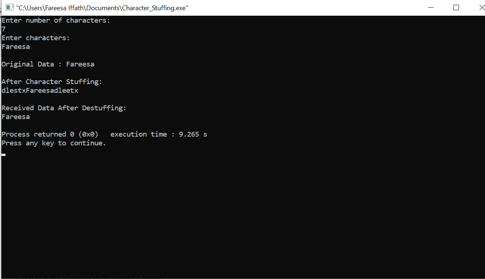

# AIM : To implement the data link layer framing method such as Character Stuffing.

## PROCEDURE :

## Step-1 : Start.

## Step-2 : Append DLE STX at the beginning of the string.

## Step-3 : Check the data if characters is present,if character DLE is present in the string insert anther DLE in the string.

## Step-4 : Transmit DLE ETX at the end of the string.

## Step-5 : Display the string.

## Step-6 : While de-stuffing neglect initial DLE STX.

## Step-7 : If DLE is present in the text,neglect it;if another DLE follows,copy the same to output.

## Step-8 : Neglect the trailing DLE ETX.

## Step-9 : Stop.

### Output :

