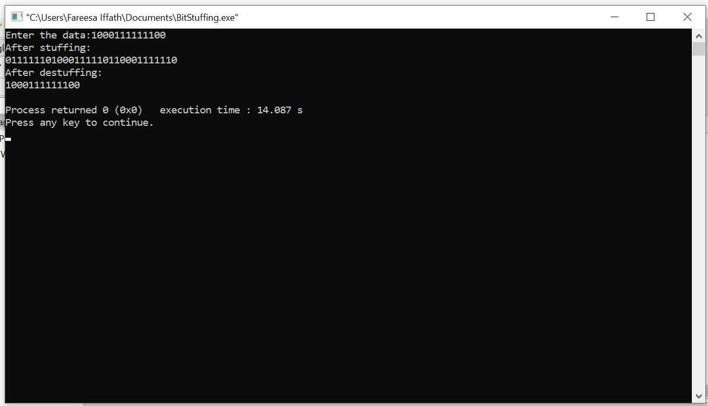

# EXPERIMENT 1 - Bit Stuffing

## AIM: To implement Bit Stuffing, one of the data link layer framing methods.

## PROCEDURE:

## Step-1: Start.

## Step-2: Initialize the array for transmitted stream with the special bit pattern 0111110 which indicates the beginning of the frame.

## Step-3: Get the bit stream to b transmitted in to the array.

## Step-4: Check for the five consecutive 1's and if they occur then stuff a bit '0'.

## Step-5: Display the data transmitted as it appears on the data line after appending 0111110 at the end.

## Step-6: For de-stuffing,copy the transmitted data to another array after detecting the stuffed bits.

## Step-7: Display the recieved bit stream.

## Step-8: Stop.

### Output:

