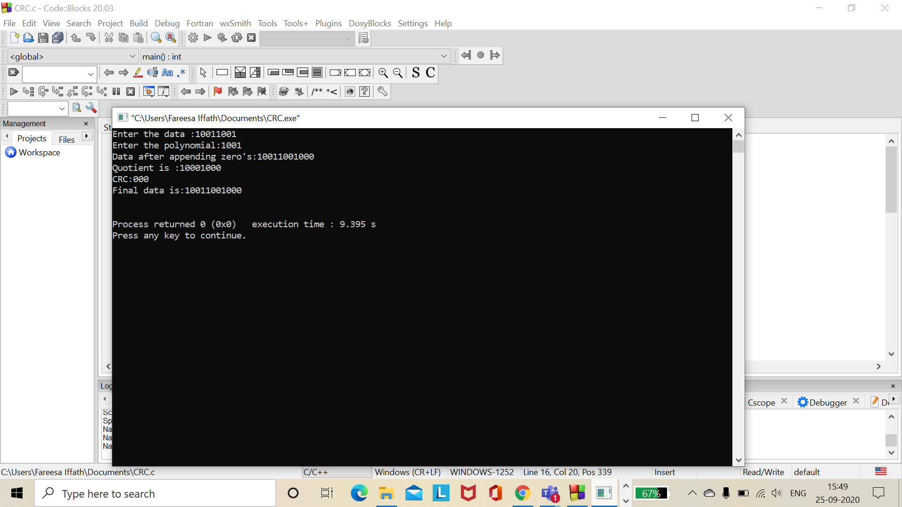

# EXPERIMENT 1:

## AIM: To implement CRC.

## PROCEDURE:

## Step 1: Read the frame.
## Step 2: Read the generator polynomial.
## Step 3: Find out the degree of the generator polynomial.
## Step 4: Append the number of the zero's to the frame,that number is equal to the degree of the polynomial.
## Step 5: Find out the number of digits in the generator polynomial.
## Step 6: Repeat the following until the number of digits are exhausted.
## Step 7: If the frame is starting with 1,then exclusive-or the frame with generator.
## Step 8: Check whether the result obtained in step-7 is starting with 1,If so exclusive-or the remainder with the generator.
## Step 9: If the result obtained in step-7 is starting with 0,then exclusive-or the remainder(result) with zeroes. The number of zeroes               must be equal to the length of the generator.

### Output:

