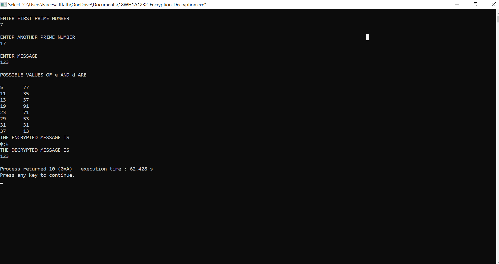

# EXPERIMENT 7

## AIM :
### Write a C program to perform Data Encryption and Data Decryption.

## PROCEDURE :

### 1. Start.

### 2. Choose two prime numbers p and q.

### 3. Compute n = p * q.

### 4. Calculate $(n)=(p-1)*(q-1).

### 5. Choose an integer e such that 1<e<$(n) and gcd(e,$(n))=1,ie. e and $(n) are coprime.

### 6. Calculate d as d = e - 1(mod $(n); here,, d is the modular multiplicative inverse of e modulo E(n).

### 7. For Encryption, c=m^e mod n,where m = original message.

### 8. For Decryption, m = c ^ d mod n.

### 9. Stop.

### OUTPUT :

