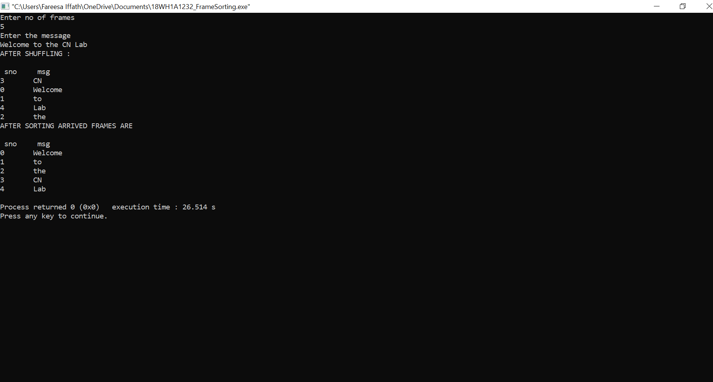

# EXPERIMENT 9

## AIM :
### Write a C program for the Frame Sorting technique  used in buffers.

## PROCEDURE :

### 1. Start.

### 2. Read the message.

### 3. Declare the function assign_seq_no() to assign sequence numbers to the frames(frames contain the original message).

### 4. Generate array of random numbers.

### 5. Declare shuffle() to shuffle the frames within the network.

### 6. Declare sort() that sorts the frames. In this you need to search for frames in sequence based on sequence number.

### 7. Finally you need to print the original message.

### 8. Stop.

### OUTPUT:

